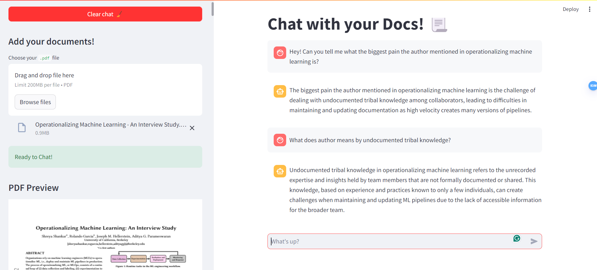

# RAG Toolbox



Let's chat with your documents!

### **Tech Stacks**
- **Frontend**: Streamlit
- **VectorDB**: Qdrant
- **Orchestration**: LlamaIndex
- **LLM**: OpenAI GPT3.5
- **Embedding model**: Fastembed

### **User Stories**
- User wants to upload own PDF document
- User wants to preview uploaded PDF document
- User wants to ask question related to PDF document
- User wants Bot to only reply within context
- User wants to chat with previous conversation context

### **Architecture**

Knowledge base  --> Chunks --> Embedding model --> Vector DB

Vector DB --> Prompt template --> LLM --> Chat UI

### **Quickstart**

**Step 1**: Install dependencies
```
pip install -r requirements.txt
```

**Step 2**: Run application
```
streamlit run app.py
```
Application will be opened in a browser.

**Done!**

<br>
<br>

***Credit to [Akshay](https://x.com/akshay_pachaar/status/1783114332471279712) for inspiration!***